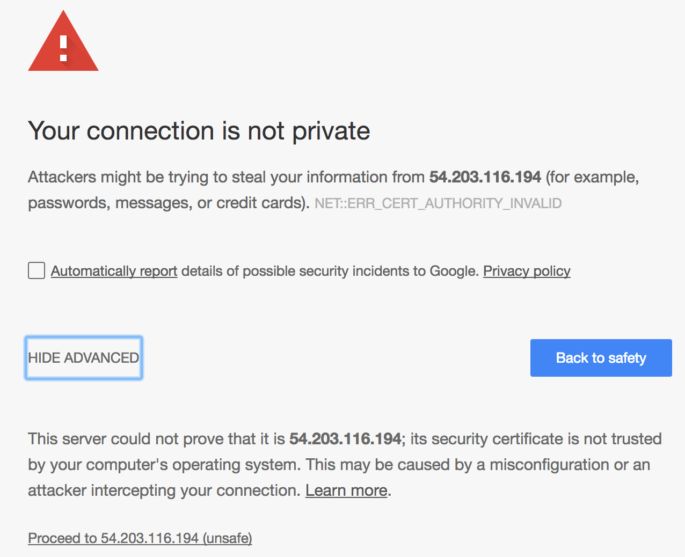

# Barracuda Link Sharing Exercise

## The Ask
Please create a simple secure link sharing service. Here’s what we’d like your web app to do:

* Provide an API to upload files.
	* The API will return an HTTP link that can be used to retrieve the file’s content.
	* To make the service more secure, the user can optionally provide a password. When a password is provided, the HTTP link will require it in order to download the file.
* HTTP links will expire after a day.
* The files will be stored encrypted at-rest 

Offer a simple UI to upload files through the browser.
Please use any programming language, framework or (free) library you deem fit. It shouldn’t take too much of your time – we prefer a very simple implementation, accompanied by concrete suggestions on best ways to extend and enhance. We’ll be paying close attention to your README with running instructions, TODOs, thoughts, and potential enhancements — so that’s a real opportunity to shine.

**Bonus:**

Deploy the application on AWS/GCP/Azure or Heroku, and send us a link to try it.

**Discussion**

In your README, please discuss in detail how you might architect the link sharing application for production usage. In particular, how can you make it reliable, secure and scalable for  millions of users? Please discuss specific stack choices in detail, and present your considerations.

##The Result
###Architecture Components
The service, deployed in AWS, is made up of:

* A single EC2 instance
* A SpringBoot application using an embedded Tomcat container
* An RDS MySQL instance
* An encrypted EBS volume for file storage
* A public and a private network
	* EC2 instance with SpringBoot app on the public network
	* RDS MySQL uses the private network so it is not accessible from the internet

###Security Considerations
For security, the service:

* Is only accessible via HTTPS
* Uses a self-signed SSL Certificate
* Uses an encrypted EBS volume for file storage
* Stores passwords in the MySQL database as encrypted data
	* Each password has a unique salt value used in the encryption
	* Clear-text passwords are never stored

###Data Storage
For each file uploaded, there is a record in an RDS MySql database which contains:

* The primary key, used as part of the returned URL to download
* Passwords that are hashed using a salt
* The salt for the hashed password
* The record creation time to calculate link expiration

The uploaded file is stored "as is" (more on this in the Moving Towards Production section) in the encrypted EBS volume using the primary key from the database row as part of the filename.

###To Access the Service

The service is available at:

<https://54.203.116.194:8443/index.html>

**Note** - that due to the fact that I am using a self-signed SSL certificate you will need to accept the "unsafe condition" by first clicking on the "Show Advanced" button, and then clicking on the "Proceed to 54.203.116.194 (unsafe)" link.  The Chrome example is shown below.

After accepting the condition, you will be shown a very simple html page where you can select the file to upload and optionally give it a password.

After hitting the "Upload" button, a URL will be displayed that can be copy-pasted in order to share the link with others.  Note that the trailing '/' in the URL is significant due to a SpringBoot configuration issue.

Upon using the link, if a password is needed or the wrong password sent the server issues a browser re-direct to a simple html page to collect the required password.

###To Do's

####Security
Although the service is in good shape as far as being secure, the password is currently being passed as an HTTP path variable.  In order to be more secure it should be passed as an HTTP auth header.

###Cleanup After Link Expiration
Currently there is no cleanup of uploaded files nor DB records when links expire.

###Better Error HTML Pages
The service does not have a handler for /error so it just uses default error pages (such as when the user attempts to download a non-existent file)

##Moving Toward Production
In order to move to a produciton stance with this service there are several areas that will need to be addressed.

###Data Storage
As mentioned above, the uploaded files are stored "as is"; when moving to a production stance the uploaded files should be:

* Compressed
* Set some reasonable filesize limit (which can be made quite large due to the next item)
* check-sum compare the uploaded file to only store 1 unique copy of the file
	* If the service were available to millions the likelyhood of large files being virally shared increases.  Being able to only store a single copy of a file uploaded millions of times would be advantageous.
* Use an object-store (AWS S3) instead of a filesystem to allow multiple servers to access the content
* Use a GUID as the stored object name instead of the filename would prevent name collisions
* Use a content distribution service such as AWS CloudFront, or Akamai to speed file download and reduce load on the primary servers

###High Availability
The service currently uses a single RDS MySQL host.  This can easily be configured within RDS to be a multi-AZ configuration for HA.

The service currently resides on a single EC2 instance.  We can create load balancer (AWS ELB) and place serveral instances behind the load balancer to manage availability within a given region.

###Scalabilty
In order to scale the service there are several things that can be done.

####Application Scalability
Adding a AWS ELB load balancer with an auto-scaling-group containing the service AMI will allow AWS to automatically stand up additional service instances on demand.  Using GUIDs as S3 object names and using that GUID as the primary key in the DB would allow all machines to be active participants in the service.

####Database Scalability
In order to scale the database access we can stand up MySQL read-replicas to handle the load involved in document download.

####Content Disribution
Use of a content distribution network such as AWS CloudFront or Akaimai would greatly speed document download times.

####Deploy to Many Regions
Deploying the service to many AWS regions would allow us to utilize geographic load distribution to ease the load on any one service instance.